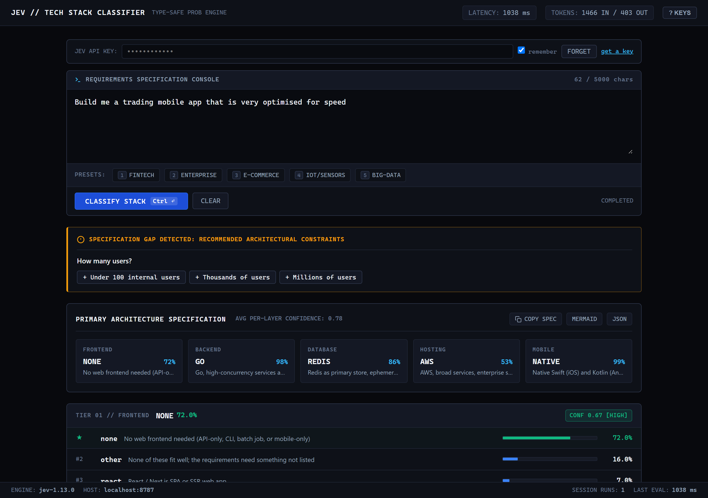
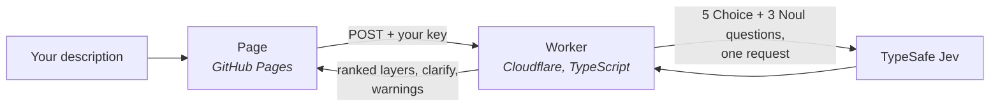
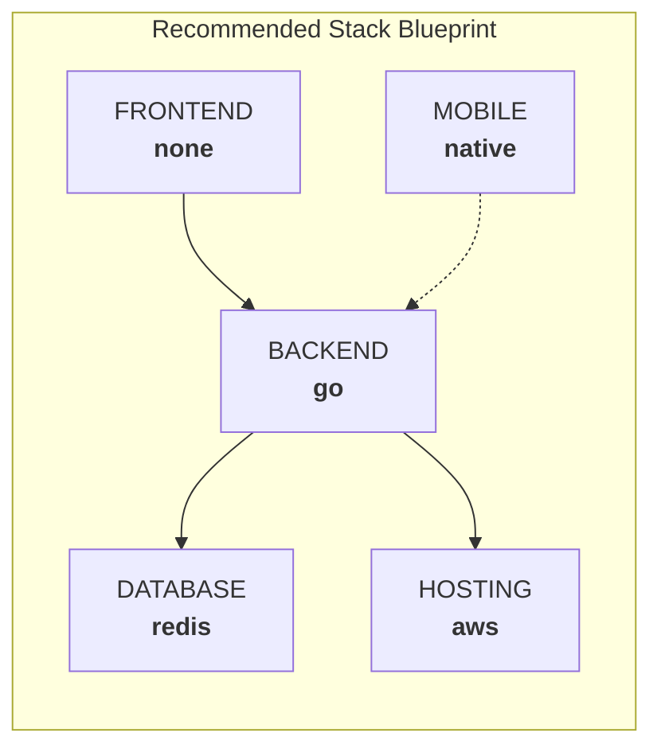

<div align="center">

# Jev Tech Stack Classifier

**Describe a software project in plain English. Get a probability-ranked tech stack.**
Frontend, backend, database, hosting and mobile, each option with its own percentage.

**[swap-mitra.github.io/jev-techstack-classifier](https://swap-mitra.github.io/jev-techstack-classifier/)**

[](https://github.com/swap-mitra/jev-techstack-classifier/actions/workflows/deploy-worker.yml)


[How it works](#how-it-works) ·
[Using it](#using-it) ·
[Exporting](#exporting-results) ·
[Shortcuts](#keyboard-shortcuts) ·
[Your API key](#your-api-key) ·
[Run locally](#run-locally) ·
[Deploy](#deploy) ·
[Customise](#customising-the-options) ·
[Limits](#known-limits)



</div>

You type what you want built, for example *"a trading mobile app that is very optimised
for speed"*, and [TypeSafe Jev](https://docs.typesafe.ai) scores every candidate
technology for each layer of the stack. Instead of one confident-sounding answer, you
see the whole distribution: the pick, the runner-ups, and how sure the model is.

> [!IMPORTANT]
> This is a **classifier, not a chatbot**. Jev does not write text or invent
> technologies. It ranks the fixed options in [`stack_config.json`](stack_config.json),
> and every layer includes an `other` option so a poor fit shows up as one.

| | |
|---|---|
| 📊 **Every option scored** | Each layer returns a full probability distribution, not just a winner. Bars, percentages and a per-layer confidence rating. |
| ❓ **Clarifying questions** | If your description leaves platform, scale or data type unclear, the app asks. One click adds the answer and re-runs. |
| ⚠️ **Clash warnings** | Picks that contradict each other (a PWA with "no frontend") are flagged. |
| 📤 **Export** | Copy the result as a Markdown table, a Mermaid diagram, or raw JSON. |
| 🔗 **Shareable links** | The prompt lives in the URL (`#q=...`), so a result is one link away. |
| 🔑 **Bring your own key** | Your TypeSafe key stays in your browser. The backend stores nothing and has no key of its own. |
| ⚡ **Fast** | One request asks all questions in parallel. Typically well under a second. |

---

## How it works



For each request the Worker asks Jev, in one call:

- **Five Choice questions**, one per layer. Each returns a probability for every option
  in that layer, which the Worker sorts into a ranking.
- **Three Noul (yes/no) questions**: does the description already make the platform,
  scale and data type clear? Any that come back below their threshold become clarifying
  questions on the page.

The browser can't call the TypeSafe API directly (it rejects cross-origin requests),
which is why the small Worker sits in between.

---

## Using it

1. Open the [live app](https://swap-mitra.github.io/jev-techstack-classifier/) and paste
   your [TypeSafe API key](https://console.typesafe.ai/) into **JEV API KEY**.
2. Describe the project, or pick a preset: **Fintech**, **Enterprise**,
   **E-commerce**, **IoT/Sensors**, **Big Data**.
3. Hit **Classify stack** (or <kbd>Ctrl</kbd>+<kbd>Enter</kbd>).

A real run of *"Build me a trading mobile app that is very optimised for speed"*
(jev-1.13.0, 718 ms, 1,466 tokens in):

| Layer | 1st | 2nd | 3rd | Confidence |
|---|---|---|---|---|
| Frontend | none 72% | other 15% | react 7% | 0.67 |
| Backend | **go 97%** | java 2% | node 1% | 0.97 |
| Database | **redis 85%** | timeseries 7% | sqlite 4% | 0.83 |
| Hosting | aws 52% | other 33% | paas 10% | 0.41 |
| Mobile | **native 99%** | flutter 1% | other 0% | 0.99 |

It also asked **"How many users?"**, because the description doesn't say.

### Reading the results

- **Summary strip**: the top pick for every layer at a glance.
- **Layer cards**: every option with its bar and percentage; the winner is marked ★.
- **Confidence** shows how concentrated a layer's distribution is:
  **HIGH** (0.60 and up), **MODERATE** (0.35 to 0.60), **LOW** (below 0.35). Hosting at
  0.41 above means aws is the favourite but "other" is a serious contender. Low
  confidence is not an error; it often means several options are reasonable.
- **Avg per-layer confidence** is the mean of the five. It is not a score for how well
  the whole stack fits.

### Clarifying questions

| Asks | When the description doesn't make clear | Options |
|---|---|---|
| Where will people use it? | web, phone, desktop, or API only | Web browser · iOS and Android apps · Web and mobile · Desktop · API only |
| How many users? | expected users or traffic | Under 100 internal · Thousands · Millions |
| What data does it mainly store? | the kind of data | Structured records · Flexible documents · Time-series · Large analytics datasets |

Clicking an answer appends it to your description and runs again. Results are always
shown, so the questions never block you.

---

## Exporting results

The buttons on the summary strip copy the current result to your clipboard.

**COPY SPEC** (or <kbd>Alt</kbd>+<kbd>C</kbd>) gives a Markdown table of the top picks:

```markdown
### Jev Recommended Tech Stack

| Layer | Technology | Probability | Description |
| :--- | :--- | :--- | :--- |
| **FRONTEND** | `none` | 72.0% | No web frontend needed (API-only, CLI, batch job, or mobile-only) |
| **BACKEND** | `go` | 97.0% | Go, high-concurrency services and infrastructure |
| **DATABASE** | `redis` | 85.0% | Redis as primary store, ephemeral or very low-latency data |
...
```

**MERMAID** gives a diagram you can paste into GitHub, Notion or any Mermaid renderer:



**JSON** gives the full response: every layer's ranking and confidence, the option
descriptions, clarifying questions, warnings, model name, token counts and latency.

**Share** by copying the address bar. After each run it holds `#q=<your prompt>`;
anyone opening it gets the prompt filled in, and it runs straight away if they already
have a key saved.

---

## Keyboard shortcuts

Press <kbd>?</kbd> in the app to see these.

| Keys | Action |
|---|---|
| <kbd>Ctrl</kbd>/<kbd>⌘</kbd> + <kbd>Enter</kbd> | Classify |
| <kbd>1</kbd> to <kbd>5</kbd> | Run a preset (when the editor isn't focused) |
| <kbd>Alt</kbd> + <kbd>C</kbd> | Copy the Markdown spec |
| <kbd>Esc</kbd> | Close the shortcuts panel, otherwise clear the editor |
| <kbd>?</kbd> | Toggle the shortcuts panel |

---

## Your API key

- Get one at [console.typesafe.ai](https://console.typesafe.ai/).
- With **remember** ticked, it is saved in your browser's local storage; **FORGET**
  removes it. Unticked, it only lives in the field until you reload.
- It is sent with each request, over HTTPS, in an `X-TypeSafe-Key` header to the Worker,
  which passes it to TypeSafe and discards it. The Worker never logs or stores it.
- Descriptions are limited to 5,000 characters.

---

## Run locally

Needs Node 22+.

```sh
git clone https://github.com/swap-mitra/jev-techstack-classifier
cd jev-techstack-classifier/worker
npm install
npx wrangler dev          # http://localhost:8787 serves the page and the API
```

Paste your key into the page as usual.

---

## Deploy

| Part | Where | How it updates |
|---|---|---|
| Page (`docs/`) | GitHub Pages, `main` branch, `/docs` | Every push to `main` |
| Worker (`worker/`) | Cloudflare Workers | [`Deploy Worker`](.github/workflows/deploy-worker.yml) action on pushes touching `worker/`, `stack_config.json` or `docs/` |

The action needs a `CLOUDFLARE_API_TOKEN` repo secret (Cloudflare's **Edit Cloudflare
Workers** token template). To deploy by hand: `cd worker && npx wrangler deploy`.

To run your own copy, change `account_id` and `ALLOWED_ORIGINS` in
[`worker/wrangler.toml`](worker/wrangler.toml), and `WORKER_URL` in
[`docs/index.html`](docs/index.html) to your Worker's address.

---

## Customising the options

Everything Jev chooses between lives in [`stack_config.json`](stack_config.json):

| Layer | Options |
|---|---|
| Frontend | react, vue, angular, svelte, server_rendered, none, other |
| Backend | node, python, java, dotnet, go, ruby, php, baas, other |
| Database | postgres, mysql, mongodb, dynamodb, redis, timeseries, sqlite, warehouse, other |
| Hosting | aws, azure, gcp, paas, on_prem, other |
| Mobile | none, react_native, flutter, native, pwa, other |

Each option has a one-line description that Jev reads, so a clear description matters
more than the key. The `clarify` section holds the three yes/no checks, the question
shown to the user, its answer buttons, and a `threshold`: the question is asked when the
"already covered" probability is below it.

After editing, check nothing regressed. With `npx wrangler dev` running:

```sh
cd worker
TYPESAFE_API_KEY=your-key npm run eval
```

[`eval.mjs`](worker/eval.mjs) runs 15 labelled prompts and checks which clarifying
questions are asked plus a few obvious picks (IoT gets `timeseries`, ad-click analytics
gets `warehouse`). All 15 pass today.

---

## Known limits

- **Fixed options.** Jev can only rank what's in the config. A technology that isn't
  listed can only show up as `other`.
- **Layers are ranked independently.** The clash warnings catch two known
  contradictions only; they don't check that the stack works as a whole.
- **Thresholds are tuned on 15 prompts.** They separate those cleanly, but real traffic
  may need retuning.
- **Confidence measures the spread, not correctness.** A HIGH rating means the
  distribution is concentrated, not that the pick is right for your business.

---

## Project layout

```
docs/index.html        the whole web app (GitHub Pages)
stack_config.json      layers, options, clarifying checks and thresholds
worker/src/index.ts    Cloudflare Worker: calls Jev, ranks, flags clashes
worker/eval.mjs        regression check over 15 labelled prompts
worker/wrangler.toml   Worker config, allowed origins, static assets
.github/workflows/     auto-deploy for the Worker
```
